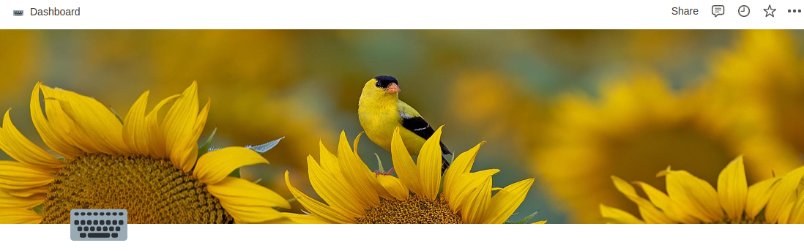

# Daily Bing to Notion

[](https://github.com/Mikaleb/Bing-Daily-Notion-cover/blob/main/LICENSE.md) [](code_of_conduct.md) 
[](https://snyk.io/test/github/Mikaleb/Bing-Daily-Notion-cover) [](https://github.com/Mikaleb/Bing-Daily-Notion-cover/issues)  


This Notion integration syncs the daily Bing image of the day for a specific repo to a Notion Page. 

## Running the project locally 

### 1. Setup your local project

```zsh
yarn
```

### 2. Set your environment variables in a `.env` file

You can create your own integration to get env variables here : https://www.notion.so/my-integrations 


```zsh
NOTION_KEY=<your-notion-api-key>
NOTION_PAGE_ID=<notion-page-id>
```

You can create your Notion API key [here](www.notion.com/my-integrations).

### 3. Run code 

```zsh
yarn start
```


### 4. Make it daily with a Cron

```zsh
30 7 * * *
```


## FAQ

Please see [here](https://github.com/Mikaleb/Bing-Daily-Notion-cover/wiki/FAQ) for a list of frequently asked questions.

##  Licensing

See the [LICENSE](https://github.com/Mikaleb/Bing-Daily-Notion-cover/blob/main/LICENSE.md) file for licensing information as it pertains to
files in this repository.

## Contribution

Bing-Daily-Notion-cover is an open-source project and we are very happy to accept community contributions. Please refer to Contributing to [Bing-Daily-Notion-cover page](https://github.com/Mikaleb/Bing-Daily-Notion-cover/blob/main/CONTRIBUTING.md) for more details.

If you run into a bug or miss a feature, please [open an issue](https://github.com/Mikaleb/Bing-Daily-Notion-cover/issues) in this repository.


